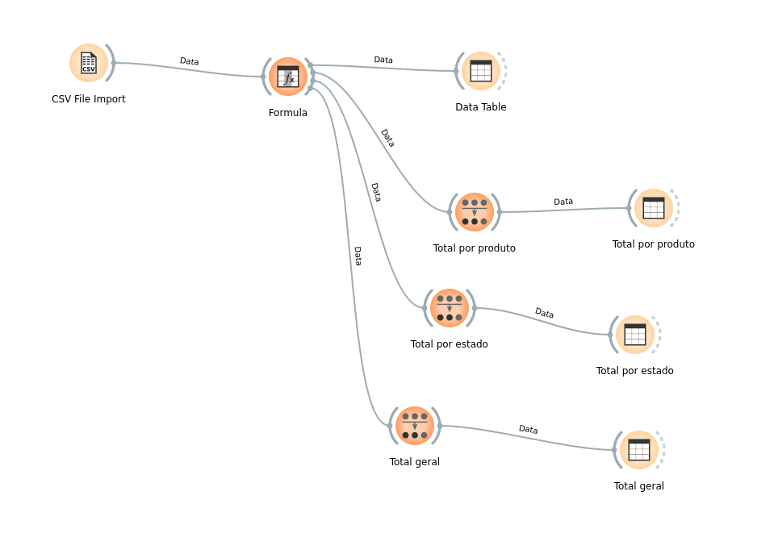

# Exercício 1 — Vendas

Análise realizada no Orange Data Mining, considerando `total_venda` como:

```text
quantidade × valor_unitario
```

## Respostas

### a) Qual produto vendeu mais?

O produto **Notebook**, com faturamento total de **R$ 24.500,00**.

### b) Qual estado apresentou mais vendas?

O estado de **São Paulo (SP)**, com faturamento total de **R$ 20.590,00**.

### c) Qual foi o valor total vendido?

O valor total vendido foi de **R$ 60.840,00**.

## Fluxo desenvolvido no Orange


