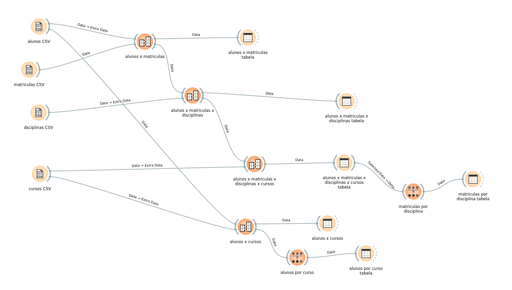

# Exercício 2 — Gestão acadêmica

Análise realizada no Orange Data Mining usando `Merge Data` para relacionar as tabelas.

## Respostas

### a) Qual curso possui mais alunos?

Houve empate entre **Data Science** e **Administração**, com **8 alunos** cada.

### b) Qual disciplina possui mais matrículas?

Houve empate entre **Estatística Aplicada** e **Introdução a Data Science**, com **11 matrículas** cada.

### c) Por que utilizar várias tabelas relacionadas pode ser melhor?

O uso de tabelas relacionadas reduz a repetição de informações, facilita atualizações, diminui inconsistências e organiza melhor os dados. As informações podem ser combinadas quando necessário por meio de junções.

## Fluxo desenvolvido no Orange

