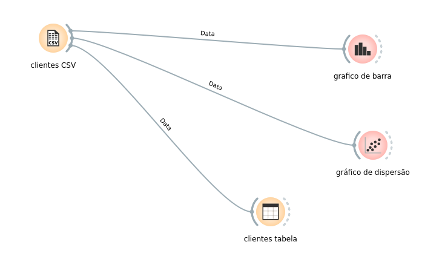

# Exercício 3 — Conhecendo os dados

Análise realizada no Orange Data Mining com uma base fictícia de 100 clientes.

## Respostas

### a) Qual faixa etária possui mais clientes?

A faixa de **26 a 35 anos**.

### b) Qual estado possui mais clientes?

**São Paulo (SP)**, com 30 clientes.

### c) Qual é a distribuição da renda?

A renda está concentrada aproximadamente entre **R$ 4.000 e R$ 8.000**, com maiores frequências próximas de R$ 6.000 e R$ 7.000. A base possui valores que chegam a aproximadamente R$ 13.000.

### d) Existe relação entre quantidade de compras e valor total das compras?

Sim. O gráfico de dispersão indica uma relação positiva: clientes com maior quantidade de compras tendem a apresentar maior valor total de compras.

## Fluxo desenvolvido no Orange

