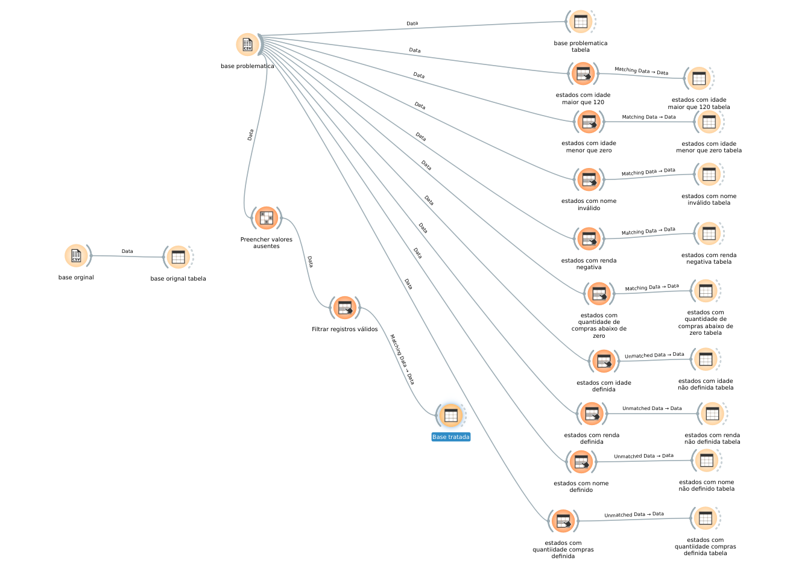

# Exercício 4 — Dados vazios e validade

A base original do Exercício 3 foi preservada em `dados/base_original.csv`.

Em `dados/base_problematica.csv` foram inseridos:

- 5 idades vazias;
- 5 rendas vazias;
- 5 estados vazios;
- 5 quantidades de compras vazias;
- idades inválidas: `250` e `-5`;
- estados inválidos: `XX`;
- rendas inválidas: `-3000` e `-1000`;
- quantidades de compras inválidas: `-10` e `-3`.

## Tratamento no Orange

O fluxo `orange/exercicio04.ows` usa `Impute` com o método `Average/Most frequent`
para preencher os valores ausentes. Em seguida, `Select Rows` mantém apenas os
registros válidos, com idade entre 0 e 120, renda e quantidade de compras não
negativas e estado diferente de `XX`.

O resultado é uma base tratada com 90 registros.

