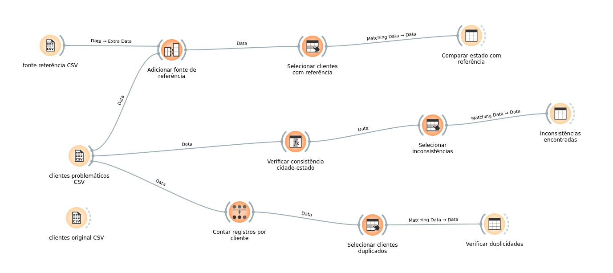

# Exercício 5 — Acurácia, duplicidade e consistência

Foram preparadas três bases para investigação no Orange:

- `dados/clientes_original.csv`: base correta com 100 clientes;
- `dados/clientes_problematicos.csv`: base com 105 registros, incluindo problemas;
- `dados/fonte_referencia.csv`: estados corretos para comparação de acurácia.

Problemas inseridos na base problemática:

- acurácia: estados alterados nos clientes `C010`, `C020`, `C040`, `C060` e `C080`;
- duplicidade: cópias dos clientes `C096` a `C100`;
- consistência: cidades e estados incompatíveis nos clientes `C011`, `C021`, `C031`, `C041` e `C051`;
  as alterações de acurácia também geraram inconsistências cidade–estado em alguns registros.

No Orange, a investigação foi feita com `Merge Data`, `Formula`, `Group by`,
`Select Rows` e `Data Table`.

## Resultados

- 5 clientes com estado diferente da fonte de referência;
- 5 clientes duplicados, cada um com duas ocorrências;
- 10 registros com inconsistência entre cidade e estado.

