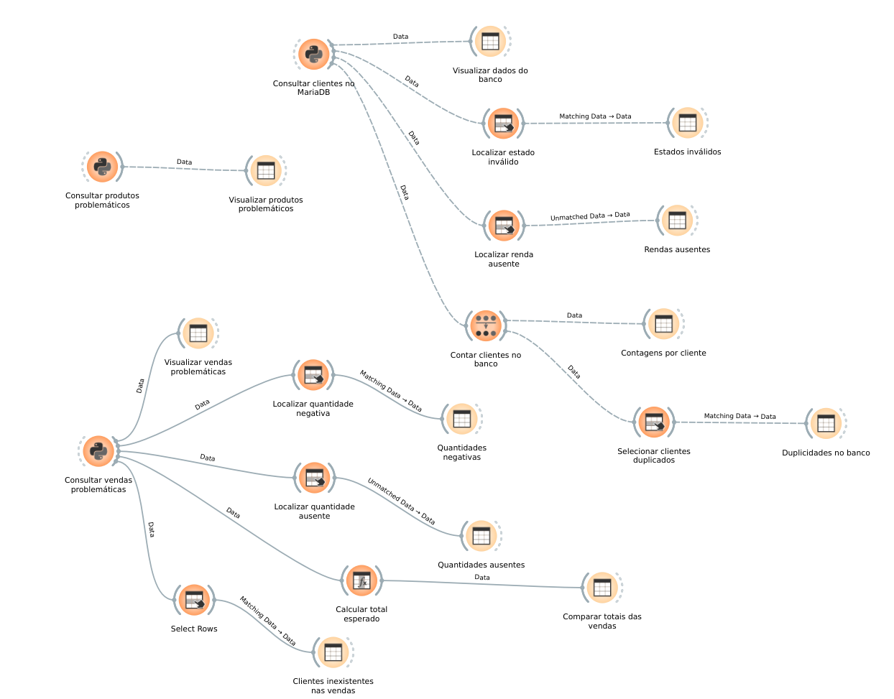

# Exercício 6 — Orange + MariaDB

Este exercício usa um MariaDB executado em container Docker e o Orange para
consultar e investigar os dados.

## Iniciar o banco

Na pasta deste exercício:

```bash
docker compose up -d
```

O banco ficará disponível em `127.0.0.1:3307`.

Credenciais de estudo:

- Banco: `datamining_ex06`
- Usuário: `datamining`
- Senha: `datamining`

## Tabelas

As tabelas `clientes_original`, `produtos_original` e `vendas_original` são as
bases corretas. As tabelas com sufixo `_problematicos` contêm dados vazios,
inválidos, duplicados e inconsistentes. A view
`vendas_problematicas_completas` combina as vendas problemáticas com clientes e
produtos usando `LEFT JOIN`.

O widget **SQL Table** do Orange não oferece conexão nativa com MariaDB. Para
manter o MariaDB em container e fazer a análise pelo Orange, instale o driver
no ambiente do Orange:

```bash
conda activate datamining
pip install PyMySQL
```

Depois, use o widget **Python Script** com o nome `Consultar dados do MariaDB`
e envie o resultado para um **Data Table** chamado `Visualizar dados do banco`.
O script deve conectar em `127.0.0.1`, porta `3307`, banco
`datamining_ex06`, usuário `datamining` e senha `datamining`.

As respostas do enunciado estão em [`respostas.md`](respostas.md).


